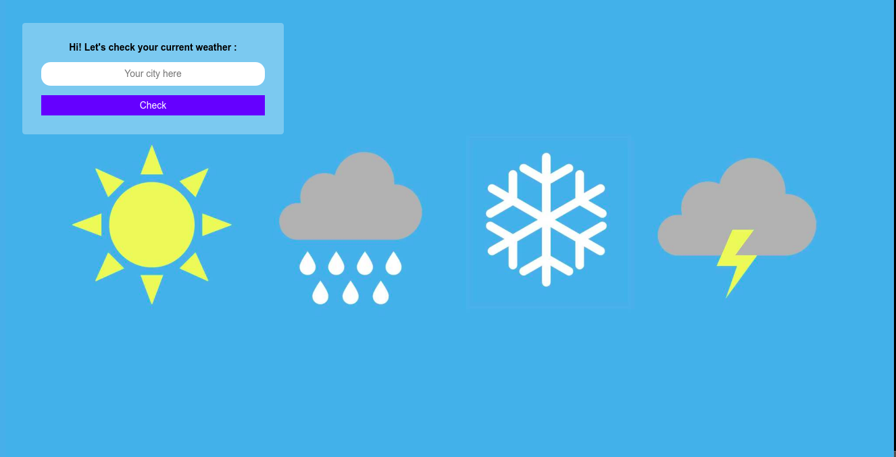
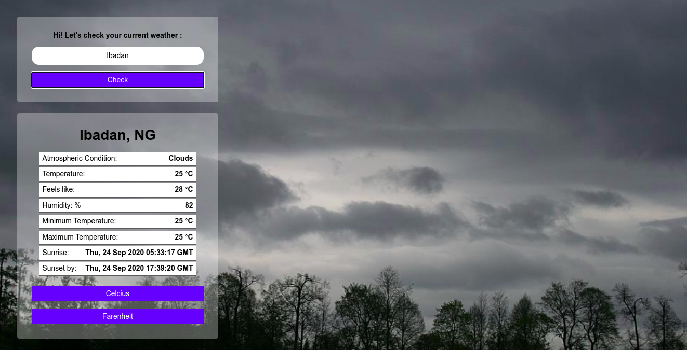
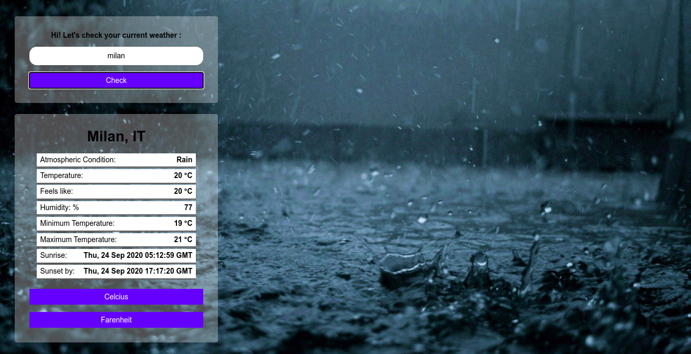
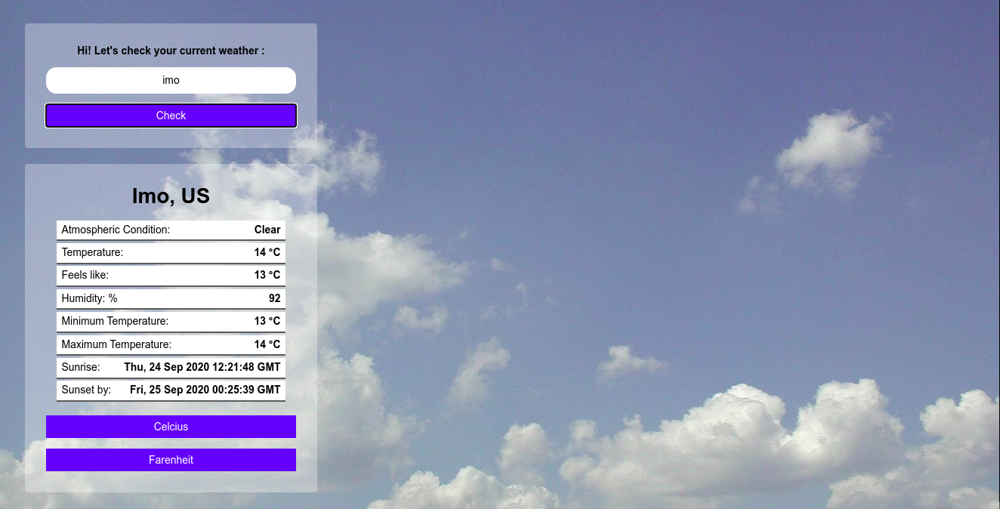

# Weather-App

> This is a Weather App built with JavaScript &amp; Webpack. The project comes at the end of the Asynchronous Javascript and APIs section of my Javascript course. It tests my knowledge about asynchronous communication with promises or async/await and when to use them. I used the Open Weather API to consume the weather details. I also processed the data fetched from the API to render in both Celcius & Fahrenheit. The background changes based on the atmospheric condition of the location provided.

Homepage

Cloudy Weather Page

Rainy Weather Page

Clear Weather Page

## Built With

- HTML
- SASS
- JavaScript (ES6)
- Webpack
- Open Weather API
- Netlify

## Live Demo

<a href="https://wappjs.netlify.app/" target="_blank">Weather App</a>

## Getting Started

To get a local copy up and running follow these simple example steps.

- On the project GitHub page, navigate to the main page of the repository [this page](https://github.com/teekaytech/Weather-App.git).
- Under the repository name, locate and click on a green button named `Code`.
- Copy the project URL as displayed.
- If you're running Windows Operating System, open your command prompt. On Linux, Open your terminal.
- Change the current working directory to the location where you want the cloned directory to be made. Leave as it is if the current location is where you want the project to be.
- Type `git clone`, and then paste the URL you copied in Step 3. 
  `$ git clone https://github.com/teekaytech/Weather-App.git` <em>Press Enter key</em> 
- Press Enter. Your local copy will be created.

Please Note that you must have github installed on your PC, this can be done [here](https://gist.github.com/derhuerst/1b15ff4652a867391f03).

### Prerequisites

Web browser (Chrome/Firefox)

### Usage

Click on the live demo link and peruse the app.

### Making Changes

- `npm install` to install the dependencies and packages
- `npm start` to test the app after changes were made

## Author

👤 **Taofeek Olalere**

- Github: [@teekaytech](https://github.com/teekaytech)
- Twitter: [@ola_lere](https://twitter.com/ola_lere)
- Linkedin: [olaleretaofeek](https://linkedin.com/in/olaleretaofeek)
- Portfolio: [Olalere Taofeek](https://teekaytech.github.io/olaleretaofeek/)

## 🤝 Contributing

Contributions, issues and feature requests are welcome!

Feel free to check the [issues page](issues/).

## Show your support

Give a ⭐️ if you like this project!

## Acknowledgments

- [Microverse](https://.microverse.org/)
- [The Odin Project (Project Spec)](https://www.theodinproject.com/courses/javascript/lessons/weather-app)

## 📝 License

This project is [MIT](lic.url) licensed.
